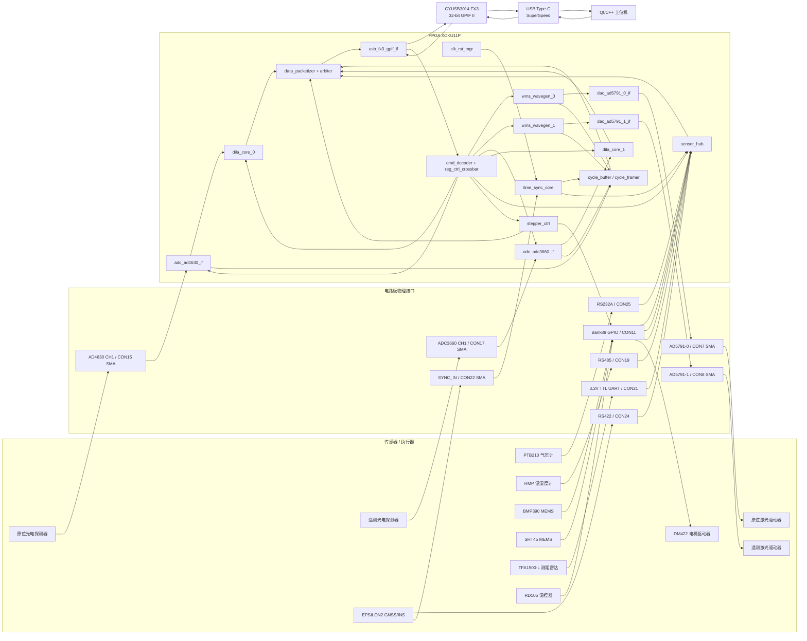
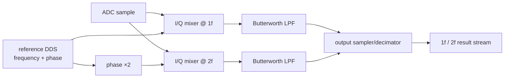

# 机载三维水汽激光雷达 FPGA 下位机详细架构与接口分配方案

> **数据通路修订 V1.1（2026-09-14）**：低速传感器使用 `msg_stream`；DILA/RAW ADC 使用 `bulk_stream`；所有 source 独立 FIFO；DILA 分片；系统消息级仲裁。

> 版本：V1.0（基于当前项目包资料形成的可实施基线）  
> 适用器件：Xilinx XCKU11P-2FFVA1156I  
> 上位机接口：USB 3.x SuperSpeed（项目需求称 USB3.1；板上实现为 CYUSB3014/FX3 + Type-C，5 Gbit/s 线速）  
> HDL：Verilog / Vivado  
> 设计目标：从传感器/执行器物理接口开始，贯通至 FPGA 功能模块、内部数据/控制链路、USB3.1 和上位机协议。

---

## 1. 本方案采用的需求基线

本项目包中同时存在：

1. 当前 `下位机需求分析.md`；
2. 较早版本的《项目开发需求表单》；
3. 电路板原理图、XCKU11P UCF 管脚表；
4. 各传感器/执行器说明书。

其中旧版表格仍保留“PCIe”“高速/低速 AD/DA”等早期描述，而当前需求已经明确：

- 原位测量和遥测测量各使用一套 DAC，均产生 WMS“低频锯齿 + 高频正弦”组合波形；
- 两套 WMS 参数独立可调；
- 两个 ADC 分别采集两个探测器，采样率独立设置；
- FPGA 内部完成 1f/2f 正交锁相解调；
- ADC 原始样点不逐点加时间戳，而是每个 WMS 锯齿扫描周期加一个时间戳；
- 其他传感器数据均加时间戳；
- 上位机链路统一采用 USB3.1；
- 需定义完整的参数设置、控制、状态、数据上传协议。

因此，本方案采用以下原则：

> **功能需求以当前 Markdown 需求为准；旧表格仅用于确认板卡已具备的硬件资源；接口、电平和引脚号以原理图、UCF 和设备说明书为准。**

---

# 2. 总体系统架构

## 2.1 端到端架构



这套架构把系统明确分成四层：

1. **设备层**：传感器、激光驱动器、探测器、电机、温控器；
2. **物理接口层**：SMA、RS232/422/485、TTL UART、GPIO、I²C、SYNC；
3. **FPGA 功能层**：波形、ADC/DAC、DILA、时间戳、设备协议、缓存、协议编解码；
4. **主机链路层**：FPGA GPIF II ↔ CYUSB3014 FX3 ↔ USB3.x ↔ Qt 上位机。

---

# 3. 推荐的全部设备物理接口分配

## 3.1 最终推荐分配总表

| 设备 | 设备侧接口 | 板卡物理接口 | 关键连接/管脚 | FPGA 物理管脚 | FPGA 模块 |
|---|---|---|---|---|---|
| 原位激光驱动器 | 模拟调制输入 | AD5791-0 模拟输出，**CON7 SMA** | SMA 中心：WMS 模拟输出；外壳：模拟地 | AD5791-0 SPI 见 4.2 | `wms_wavegen_0` → `dac_ad5791_0_if` |
| 原位光电探测器 | 模拟输出 | AD4630 CH1，**CON15 SMA** | 探测器模拟电压 → ADC CH1 | AD4630 数字口见 4.3 | `adc_ad4630_if` → `dila_core_0` |
| 遥测激光驱动器 | 模拟调制输入 | AD5791-1 模拟输出，**CON8 SMA** | SMA 中心：WMS 模拟输出；外壳：模拟地 | AD5791-1 SPI 见 4.2 | `wms_wavegen_1` → `dac_ad5791_1_if` |
| 遥测光电探测器 | 模拟输出 | ADC3660 CH1，**CON17 SMA** | 探测器模拟电压 → ADC CH1 | ADC3660 数字口见 4.4 | `adc_adc3660_if` → `dila_core_1` |
| PTB210 气压计 | RS232 | **CON25 RS232A** | CON25-2 TX→PTB RX；CON25-3 RX←PTB TX；CON25-5 GND | TX AM14；RX AL14 | `ptb210_rs232` |
| HMP 温湿度计 | RS485/Modbus RTU | **CON19 RS485** | CON19-5 A↔HMP pin4 RS485+；CON19-1 B↔pin2 RS485-；CON19-3 GND↔pin3 | TX AN16；RX AM17；DE/RE AN19 | `hmp_modbus_rs485` |
| EPSILON2 GNSS/INS | RS422 + SYNC | **CON24 RS422** + **CON22 SYNC_IN SMA** | 见 3.4 | RX AM15；TX AN18；SYNC AP18 | `epsilon_rs422` + `time_sync_core` |
| BMP390 MEMS | I²C | **CON11 Bank88 GPIO** | SCL=CON11-1；SDA=CON11-3；INT=CON11-2（可选） | AH13 / AJ13 / AN13 | `i2c_master` + `bmp390_driver` |
| SHT45 MEMS | I²C | 与 BMP390 共用 **CON11** I²C 总线 | SCL=CON11-1；SDA=CON11-3；地址 0x44 | AH13 / AJ13 | `i2c_master` + `sht45_driver` |
| TFA1500-L 测距雷达 | 3.3V TTL UART | **CON21 TTL UART**；低频输出另占 CON11-4 | 高频 TX→CON21-1；RX←CON21-2；EN←CON21-3；GND→CON21-4；低频 TX→CON11-4 | RX AN14；TX AP14；EN AK16；LF RX AP13 | `tfa1500_uart` |
| RD105 温控器 | TTL 串口（协议手册） | **CON11 GPIO 软件 UART** | FPGA TX=CON11-5；FPGA RX=CON11-7 | AM12 / AN12 | `rd105_uart` |
| DM422 电机驱动器 | PUL/DIR/ENA | **CON11 GPIO** + 外置驱动/开漏级 | PUL=CON11-9；DIR=CON11-11；ENA=CON11-10 | AM11 / AN11 / AK12 | `stepper_ctrl` |

> **说明 1：**原位和遥测 ADC 推荐使用两个不同 ADC 芯片（AD4630、ADC3660），这样“两个 ADC 采样率独立可调”可以在物理层真正独立实现。若改为同一双通道 ADC 的两个通道，则通常共享采样时钟，只能通过数字抽取实现“有效输出率”独立，并非真正独立采样时钟。
>
> **说明 2：**两个激光驱动器优先使用两颗 AD5791，对称、独立且便于软件配置。若后续 WMS 高频正弦频率非常高、要求 DAC 每个正弦周期具有大量采样点，可把两路改到 AD3552R 的两个通道（CON4/CON5），FPGA 上层 `wms_wavegen` 不需要重写，只替换 DAC 驱动适配层。

---

## 3.2 PTB210 气压计 → RS232A

PTB210 手册给出的数字接口支持 RS232C/RS485/TTL 版本。当前推荐使用 RS232 版本接板载 RS232A，从而避免占用通用 GPIO。

### 物理连接

| PTB210 线 | 含义 | 板卡连接 |
|---|---|---|
| 灰色 | PTB210 RX | CON25 pin2 `RS232A_TXD` |
| 绿色 | PTB210 TX | CON25 pin3 `RS232A_RXD` |
| 蓝色 | GND | CON25 pin5 GND |
| 粉色 | 电源 | 外部供电，按设备版本要求供电，不从 FPGA I/O 供电 |
| 黄色 | 外部电源控制 | 本项目可不接，除非后续需要远程上下电 |

### FPGA 网络

- `FPGA_RS232A_TXD`：XCKU11P **AM14**；
- `FPGA_RS232A_RXD`：XCKU11P **AL14**。

### FPGA 模块

`ptb210_rs232`：

- 输入：`clk`、`rst_n`、`uart_rx`、配置寄存器；
- 输出：`uart_tx`、`pressure_valid`、`pressure_value`、`sensor_status`、标准化数据流；
- 默认可按手册 9600 baud 起步，最终波特率由寄存器配置。

---

## 3.3 HMP 温湿度计 → RS485

HMP 系列 M12 接口推荐采用 RS485/Modbus RTU。

### HMP M12 5-pin

| HMP pin | 功能 | 板卡连接 |
|---|---|---|
| 1 | 电源 | 外部 15–30 V（具体型号按手册） |
| 2 | RS485 - | CON19 pin1 `RS485_B` |
| 3 | 电源地/RS485 common | CON19 pin3 GND |
| 4 | RS485 + | CON19 pin5 `RS485_A` |
| 5 | NC | 不接 |

### FPGA 网络

- `FPGA_RS485_TXD_L`：**AN16**；
- `FPGA_RS485_RXD_L`：**AM17**；
- `FPGA_RS485_DERE_L`：**AN19**。

板上 SP3485 已完成 FPGA 侧逻辑电平和 RS485 差分物理层转换，因此 FPGA 模块只处理 UART 字节、Modbus RTU 帧和收发方向。

### 推荐参数

- 默认 19200 baud；
- 8 data bits；
- no parity；
- 2 stop bits；
- 地址按设备实际配置，手册默认地址可作为初始值。

---

## 3.4 EPSILON2 GNSS/INS → RS422 + 硬件同步脉冲

GNSS/INS 是整个系统时间同步的关键设备，推荐把唯一的板载 RS422 和独立 `SYNC_IN` 优先给它。

### RS422 数据连接

EPSILON2 辅助连接器：

| EPSILON2 aux pin | 功能 | 板卡 CON24 |
|---|---|---|
| 1 | GND | pin5 GND |
| 6 | RS422 Y / TX+ | pin2 `RS422_RXA` |
| 7 | RS422 Z / TX- | pin3 `RS422_RXB` |
| 9 | RS422 A / RX+ | pin7 `RS422_TXY` |
| 8 | RS422 B / RX- | pin8 `RS422_TXZ` |

含义是：设备 TX 差分对接板卡接收端 A/B；板卡发送端 Y/Z 接设备 RX+/-。

### FPGA 网络

- `FPGA_RS422_RXD_L`：**AM15**；
- `FPGA_RS422_TXD_L`：**AN18**。

### 同步脉冲

EPSILON2 主连接器 pin7 `SYNC` → 板卡 **CON22 SMA (`SYNC_IN_5V0`)** → 板上电平转换 → FPGA：

- `SYNC_IN`：**AP18**。

`time_sync_core` 在 `SYNC_IN` 有效沿处锁存 64-bit 本地计数器值，并把该硬件事件与 GNSS 串口报文中的 UTC/周内秒等信息关联。这样，内部所有数据首先以统一的硬件 tick 对齐，再由上位机转换为绝对时间。

---

## 3.5 BMP390 + SHT45 → 共用 I²C GPIO 总线

两颗 MEMS 器件都适合使用 I²C，且地址不同，因此没有必要浪费两组接口。

### I²C 总线分配

| 信号 | 板卡 | FPGA ball | 用途 |
|---|---|---:|---|
| `I2C_SCL` | CON11 pin1 = `GPIO_BANK88_LP1` | **AH13** | BMP390 + SHT45 SCL |
| `I2C_SDA` | CON11 pin3 = `GPIO_BANK88_LN1` | **AJ13** | BMP390 + SHT45 SDA |
| `BMP390_INT` | CON11 pin2 = `GPIO_BANK88_LP2` | **AN13** | 可选中断/数据就绪 |

SCL/SDA 外部加 **3.3 V 上拉电阻**；不要依赖 FPGA 内部弱上拉完成正式硬件设计。

### BMP390

- SCL：pin2；
- SDA：pin4；
- `CSB` 置高进入 I²C 模式；
- `SDO` 用于地址选择：建议拉低得到 **0x76**；
- `INT` 可接上述 CON11 pin2；
- 供电按实际模块/裸芯片电压规范执行。

### SHT45

项目资料中的模块默认 I²C 地址为 **0x44**，与 BMP390 不冲突，可直接共总线。

### FPGA 模块层次

```text
i2c_master
 ├── bmp390_driver
 └── sht45_driver
```

`i2c_master` 只负责 START/STOP/ACK/时序；两个设备 driver 负责寄存器、测量命令、CRC/换算和采集周期。

---

## 3.6 TFA1500-L 测距雷达 → 板载 TTL UART

该设备使用 3.3 V TTL UART，默认 500000 baud，并提供“高频输出 TX”和“低频输出 TX”两个独立输出脚。

### 推荐连接

| TFA1500-L pin | 功能 | 板卡连接 |
|---|---|---|
| 1 | GND | CON21 pin4 GND |
| 2 | Vin 3–5 V | 独立电源 |
| 3 | 高频 UART TX | CON21 pin1 `FPGA_UART_RXD` |
| 4 | 低频 UART TX | CON11 pin4 `GPIO_BANK88_LN2` |
| 5 | UART RX | CON21 pin2 `FPGA_UART_TXD` |
| 6 | Power_EN | CON21 pin3 `FPGA_UART_EN` |

### FPGA 网络

板载 TTL UART：

- RX：`FPGA_UART_RXD_L` = **AN14**；
- TX：`FPGA_UART_TXD_L` = **AP14**；
- EN：`FPGA_UART_EN_L` = **AK16**。

低频 TX 备用输入：

- `GPIO_BANK88_LN2` = **AP13**。

这样上位机既可以选择高频输出，也可以切换到低频模式而不重新接线。

---

## 3.7 RD105 温控器 → GPIO 软件 UART

RD105 协议资料表明其支持 TTL 串口/RS485；板载 RS485 已分配给 HMP，为减少资源争用，推荐用 Bank88 实现一组软件 UART。

| 信号 | CON11 | FPGA ball |
|---|---:|---:|
| FPGA TX → RD105 RX | pin5 `GPIO_BANK88_LP3` | **AM12** |
| FPGA RX ← RD105 TX | pin7 `GPIO_BANK88_LN3` | **AN12** |
| GND | 线束公共地 | — |

推荐起始参数：38400, 8N1。

> **必须确认项：**当前项目包内 RD105 PDF 主要给出通信协议，没有足够明确的“设备插座物理 pin 编号 + TTL 高电平电压”信息。因此本方案只冻结 **FPGA 板卡侧 pin**，RD105 设备侧接插件脚位和电平必须在做线束前用实物标签/厂家完整硬件手册确认。如果 TTL 不是 3.3 V 兼容，CON11 与 RD105 之间必须加电平转换/缓冲器，禁止直接接 FPGA。

---

## 3.8 DM422 电机驱动器 → GPIO + 外置驱动级

DM422 输入为光耦式 `PUL/DIR/ENA`，允许较宽的 5–24 V 控制范围，但不能因为“能识别 5 V”就默认可以由 FPGA 3.3 V I/O 直接可靠驱动。

推荐使用 **共阳接法 + 外置 N-MOS/开漏或专用缓冲级**：

- PUL+ / DIR+ / ENA+ → +5 V；
- PUL- / DIR- / ENA- 由外部晶体管下拉；
- FPGA 只驱动晶体管逻辑输入。

### FPGA 管脚

| 信号 | CON11 | FPGA ball |
|---|---:|---:|
| `MOTOR_PUL` | pin9 `GPIO_BANK88_LP5` | **AM11** |
| `MOTOR_DIR` | pin11 `GPIO_BANK88_LN5` | **AN11** |
| `MOTOR_ENA` | pin10 `GPIO_BANK88_LP6` | **AK12** |

`stepper_ctrl` 中固化安全时序下限：

- PUL 高/低脉宽不小于 2.5 μs；
- DIR 改变后至少等待 5 μs 再产生下一步进脉冲；
- 支持目标步数、方向、步进频率、连续/定长运动、急停和软停止。

---

# 4. 两套 WMS 光学测量链路

## 4.1 推荐链路

### 原位测量系统

```text
上位机 WMS0 参数
   ↓ USB 命令
wms_wavegen_0
   ↓ DAC code
AD5791-0 FPGA driver
   ↓
AD5791-0 → CON7 SMA
   ↓ 模拟 锯齿+正弦
原位激光驱动器
   ↓ 光学系统
原位光电探测器
   ↓ 模拟电压
CON15 SMA → AD4630 CH1
   ↓ 24-bit ADC samples
adc_ad4630_if
   ├──→ cycle_buffer_0 → USB 原始周期数据
   └──→ dila_core_0 → 1f/2f → USB
```

### 遥测系统

```text
上位机 WMS1 参数
   ↓ USB 命令
wms_wavegen_1
   ↓ DAC code
AD5791-1 FPGA driver
   ↓
AD5791-1 → CON8 SMA
   ↓ 模拟 锯齿+正弦
遥测激光驱动器
   ↓ 光学系统
遥测光电探测器
   ↓ 模拟电压
CON17 SMA → ADC3660 CH1
   ↓ ADC samples
adc_adc3660_if
   ├──→ cycle_buffer_1 → USB 原始周期数据
   └──→ dila_core_1 → 1f/2f → USB
```

---

## 4.2 AD5791 两路 DAC 的 FPGA 引脚

### AD5791-0 → CON7（原位）

| UCF net | FPGA ball |
|---|---:|
| `DAC_AD5791_0_SCLK` | K21 |
| `DAC_AD5791_0_RSTN` | M21 |
| `DAC_AD5791_0_SYNCN` | K25 |
| `DAC_AD5791_0_SDIN` | L24 |
| `DAC_AD5791_0_SDO` | L27 |
| `DAC_AD5791_0_CLRN` | H24 |
| `DAC_AD5791_0_LDACN` | H27 |

### AD5791-1 → CON8（遥测）

| UCF net | FPGA ball |
|---|---:|
| `DAC_AD5791_1_SCLK` | R22 |
| `DAC_AD5791_1_RSTN` | G26 |
| `DAC_AD5791_1_SYNCN` | J26 |
| `DAC_AD5791_1_SDIN` | G27 |
| `DAC_AD5791_1_SDO` | H26 |
| `DAC_AD5791_1_CLRN` | J24 |
| `DAC_AD5791_1_LDACN` | H23 |

### `wms_wavegen` 输出定义

每个实例独立支持：

- `saw_freq_word`：锯齿频率；
- `saw_amplitude`；
- `saw_offset`；
- `sine_freq_word`：正弦频率；
- `sine_amplitude`；
- `sine_phase_offset`；
- `wave_enable`；
- `wave_commit`：影子寄存器一次性生效；
- `scan_start`：每个锯齿周期 1 pulse；
- `cycle_id[31:0]`。

推荐用相位累加器 DDS 产生正弦，锯齿同样由相位累加器高位映射，保证频率可以精细配置且两个分量相位连续。

---

## 4.3 AD4630（原位 ADC）FPGA 引脚

| UCF net | FPGA ball |
|---|---:|
| `ADC_AD4630_SDI` | K20 |
| `ADC_AD4630_RSTN` | R21 |
| `ADC_AD4630_CNV` | P21 |
| `ADC_AD4630_BUSY` | P20 |
| `ADC_AD4630_CSN` | L22 |
| `ADC_AD4630_SCK` | N23 |
| `ADC_AD4630_SDO[0]` | R25 |
| `ADC_AD4630_SDO[1]` | R26 |
| `ADC_AD4630_SDO[2]` | T24 |
| `ADC_AD4630_SDO[3]` | R23 |
| `ADC_AD4630_SDO[4]` | N21 |
| `ADC_AD4630_SDO[5]` | L20 |
| `ADC_AD4630_SDO[6]` | M20 |
| `ADC_AD4630_SDO[7]` | K22 |

`adc_ad4630_if` 负责：

- 上电配置；
- 按 `sample_rate_cfg` 产生 CNV；
- BUSY/数据时序；
- 多线串行数据拼接为统一样点；
- `sample_valid/sample_data`；
- 溢出、超时、自检状态；
- 向 DILA 与周期缓存同时分发样点。

---

## 4.4 ADC3660（遥测 ADC）FPGA 引脚

| UCF net | FPGA ball |
|---|---:|
| `ADC_ADC3660_DB6` | M22 |
| `ADC_ADC3660_DB5` | N22 |
| `ADC_ADC3660_DA5` | P23 |
| `ADC_ADC3660_SCLK` | P24 |
| `ADC_ADC3660_DCLKIN` | P26 |
| `ADC_ADC3660_DCLK` | N24 |
| `ADC_ADC3660_CLKN` | M26 |
| `ADC_ADC3660_CLKP` | M25 |
| `ADC_ADC3660_SEN` | K23 |
| `ADC_ADC3660_DA6` | L23 |
| `ADC_ADC3660_FCLK` | M27 |
| `ADC_ADC3660_SDIO` | J23 |
| `ADC_ADC3660_RST` | J25 |
| `ADC_ADC3660_SYNC` | G25 |

实际 RTL 必须以原理图所采用的数据输出模式（串行/DDR lane 配置）为准，实现输入时钟约束和必要的 IDDR/ISERDES 采样。

---

## 4.5 AD3552R 作为高速 DAC 预留替代

板上 AD3552R 两通道输出分别连接：

- CH1 → **CON4 `HSDAC_CH1_OUT`**；
- CH2 → **CON5 `HSDAC_CH2_OUT`**。

FPGA 引脚：

| UCF net | FPGA ball |
|---|---:|
| `DAC_AD3552_SDIO[0]` | P25 |
| `DAC_AD3552_SDIO[1]` | L25 |
| `DAC_AD3552_SDIO[2]` | N27 |
| `DAC_AD3552_SDIO[3]` | N26 |
| `DAC_AD3552_RSTN` | T25 |
| `DAC_AD3552_LDACN` | R27 |
| `DAC_AD3552_ALERTN` | T27 |
| `DAC_AD3552_QSPI` | M24 |
| `DAC_AD3552_CSN` | K27 |
| `DAC_AD3552_SCLK` | K26 |

建议工程中把波形层和 DAC 驱动层解耦：

```text
wms_wavegen -> dac_sample_stream -> {ad5791_adapter OR ad3552_adapter}
```

这样后续只需通过顶层参数切换 DAC，而不修改 WMS 算法和 USB 寄存器定义。

---

# 5. FPGA 模块划分、功能与输入输出

## 5.1 顶层推荐文件树

```text
rtl/
├── top/
│   └── vapor_lidar_top.v
├── clock/
│   ├── clk_rst_mgr.v
│   └── cdc_sync.v
├── time/
│   ├── time_sync_core.v
│   └── timestamp_capture.v
├── wms/
│   ├── wms_wavegen.v
│   └── sine_lut_or_cordic.v
├── dac/
│   ├── dac_ad5791_if.v
│   └── dac_ad3552_if.v          # 预留/替代
├── adc/
│   ├── adc_ad4630_if.v
│   └── adc_adc3660_if.v
├── dila/
│   ├── dila_core.v
│   ├── ref_dds.v
│   ├── iq_mixer.v
│   ├── butterworth_lpf.v
│   └── dila_output_sampler.v
├── sensors/
│   ├── uart_core.v
│   ├── rs485_halfduplex_ctrl.v
│   ├── i2c_master.v
│   ├── ptb210_rs232.v
│   ├── hmp_modbus_rs485.v
│   ├── epsilon_rs422.v
│   ├── bmp390_driver.v
│   ├── sht45_driver.v
│   ├── tfa1500_uart.v
│   └── rd105_uart.v
├── motor/
│   └── stepper_ctrl.v
├── buffer/
│   ├── adc_cycle_framer.v
│   ├── async_fifo_wrap.v
│   └── stream_fifo.v
├── control/
│   ├── cmd_decoder.v
│   ├── reg_ctrl_crossbar.v
│   └── status_manager.v
└── usb/
    ├── usb_fx3_gpif_if.v
    ├── stream_arbiter.v
    ├── data_packetizer.v
    └── crc32.v
```

---

## 5.2 `clk_rst_mgr`

**功能**

- 接收板载参考时钟；
- 产生系统逻辑时钟、USB/GPIF 相关时钟、必要的 ADC/DAC 工作时钟；
- 生成上电复位和各时钟域同步复位；
- 提供 `locked`/故障状态。

**输入**

- 板载 reference clock；
- 全局 reset；
- 软件模块 reset 请求。

**输出**

- `sys_clk`（建议 100 MHz）；
- `time_clk`（可与 `sys_clk` 相同）；
- 设备需要的派生时钟；
- `rst_sys_n` 等同步复位。

**连接**

所有模块都只使用由本模块定义的时钟/复位；不同域之间禁止直接跨接多 bit 数据，统一使用 async FIFO 或握手 CDC。

---

## 5.3 `time_sync_core`

**功能**

- 运行 64-bit 自由运行硬件计数器；
- 捕获 GNSS `SYNC_IN`；
- 对同步沿产生精确时间标签；
- 为所有模块提供统一 timestamp；
- 保存 `sync_valid`、最近同步 tick、同步序号和失锁状态。

**推荐时间基准**

若采用 100 MHz：

- 1 tick = 10 ns；
- 64 bit 回绕时间远大于项目寿命；
- 上位机通过 `tick_hz=100000000` 换算秒。

**重要设计原则**

本地计数器不要因 GNSS 校正而“突然跳变”。绝对 UTC 与本地 tick 的对应关系用同步事件表建立，使同一批数据时间始终单调。

---

## 5.4 `wms_wavegen_0/1`

**功能**

- 产生低频锯齿；
- 产生高频正弦；
- 定点相加、限幅、映射为 DAC code；
- 在每个锯齿周期开始发出 `scan_start`；
- 维护 `cycle_id`；
- 参数使用 shadow/active 双寄存器，在周期边界原子切换，避免半个扫描周期使用新旧参数混合。

**输入**

- `saw_freq/amplitude/offset`；
- `sine_freq/amplitude/phase`；
- `enable`；
- `cfg_commit`；
- `dac_ready`。

**输出**

- `dac_sample`；
- `dac_sample_valid`；
- `scan_start`；
- `cycle_id`；
- 可选 `sine_phase` 给 DILA 作为相干参考。

---

## 5.5 DAC 接口模块

### `dac_ad5791_0_if` / `dac_ad5791_1_if`

**输入**：统一 `dac_sample` stream、初始化/校准命令。  
**输出**：`sample_ready`、SPI 物理信号、状态。  
**连接**：`wms_wavegen_i → dac_if_i → AD5791_i → 激光驱动器`。

DAC 驱动层不得生成 WMS 波形，只负责把数值可靠送到器件，以保证分工边界清晰。

---

## 5.6 ADC 接口模块

### `adc_ad4630_if`

**输入**：`sample_rate_cfg`、enable、AD4630 BUSY/SDO。  
**输出**：`sample_data[23:0]`、`sample_valid`、状态。  

### `adc_adc3660_if`

**输入**：`sample_rate_cfg`、enable、ADC3660 data/clock。  
**输出**：统一格式 `sample_data`、`sample_valid`、状态。

两种 ADC 在上层必须使用相同的标准 sample-stream 接口，例如：

```text
sample_valid
sample_ready
sample_data[31:0]   # 原始位宽左/右对齐规则固定
sample_chan[1:0]
sample_overrange
```

这样 DILA 不关心底层是哪一种 ADC。

---

## 5.7 `adc_cycle_framer_0/1`

这是实现“**每个 WMS 扫描周期只加一个时间戳**”的关键模块。

**输入**

- ADC `sample_valid/data`；
- 对应 `wms_wavegen.scan_start`；
- `time_sync_core.timestamp`；
- `cycle_id`。

**行为**

1. `scan_start` 到达时锁存 `cycle_timestamp`；
2. 关闭上一周期 frame；
3. 为新周期清零样点计数；
4. 后续每个 ADC 样点只写数据，不重复写 timestamp；
5. 下一个 `scan_start` 或达到设定样点数时结束该 cycle frame；
6. 整个 frame 作为一个 USB 数据对象进入 packetizer。

**输出数据语义**

```text
ADC_CYCLE_HEADER:
  source_id
  cycle_id
  timestamp
  adc_sample_rate
  sample_count
  flags
RAW_SAMPLES[]
```

这样完全符合当前需求，又显著降低时间戳带宽。

---

# 6. DILA 正交锁相模块设计

每套光学系统各实例化一个 `dila_core`，避免资源调度导致两个通道互相影响，便于独立测试。



## 6.1 可调参数

按照项目需求至少包含：

- 解调基频 `demod_f0`；
- 参考相位 `phase_1f`；
- 2f 相位可由 1f 倍频或独立提供修正量；
- 输出采样率 `output_rate`；
- enable/bypass/reset；
- 数据输出格式选择（I/Q、幅值，建议内部始终保留 I/Q）。

## 6.2 固定参数

首版 Butterworth LPF 的：

- 阶数；
- 截止频率；
- 系数；
- 定点字长；

作为编译参数固定。等系统稳定后，再决定是否开放为上位机可配置。

## 6.3 与 WMS 的相位关系

默认推荐 DILA reference DDS 直接使用 WMS 正弦相位累加器或其同步副本，而不是另起一个完全自由运行的 NCO。这样当上位机修改 WMS 正弦频率时，解调参考仍可以无漂移地与激光调制保持相干。

如用户确需“解调频率与 WMS 调制频率独立”，则寄存器允许关闭 phase-lock，切换到独立 `demod_f0`。

---

# 7. 统一传感器模块接口

所有非 ADC 传感器模块完成各自协议后，不直接操作 USB，而统一输出 `msg_stream`。每个传感器必须具有独立消息 FIFO；多个传感器同时产生数据时，先各自缓存，再由 `sensor_hub` 做消息级 round-robin。

统一低速消息接口：

```text
m_valid / m_ready
m_data[31:0] / m_keep[3:0]
m_sof / m_last
m_source_id[15:0]
m_msg_id[15:0]
m_timestamp[63:0]
m_cycle_id[31:0]
m_flags[31:0]
```

每个传感器 driver 后设置独立 FIFO。`sensor_hub` 一旦选择某个 source，必须从 SOF 一直发送到 LAST 后才能切换，禁止不同传感器 beat 级交错。

DILA 和 RAW ADC 不使用该低速消息通路，而使用单独的 `bulk_stream`，避免大数据与短消息语义混淆。

---

# 8. 时间同步与时间戳方案

## 8.1 三类时间戳

### A. WMS/ADC 周期时间戳

- 一个锯齿扫描周期一个 timestamp；
- 建议定义为 **锯齿周期开始时刻**；
- `cycle_id` 和 timestamp 同时锁存；
- 原始 ADC 样点不逐点带 timestamp；
- 上位机通过本周期 timestamp、sample_rate 和 sample index 仍可恢复任意样点近似时间。

### B. 串口传感器

在“收到一帧的第一个有效字节”时锁存时间戳，解析完成后把该 timestamp 附加到数据帧。这样相比“解析完才计时”抖动更小。

### C. I²C 传感器

对于主动触发测量的设备，优先给“测量触发时刻”加时间戳；如果设备工作在连续模式，则可给 `data-ready` 中断沿或读数开始时刻加时间戳。每个 driver 对 timestamp 语义在状态字段中保持固定。

---

## 8.2 GNSS 绝对时间对应

推荐上位机同时收到两类消息：

1. `GNSS_NAV`：UTC/定位/姿态等解析数据；
2. `TIME_SYNC_EVENT`：`sync_seq + local_tick_at_sync + GNSS time tag`。

由上位机建立：

```text
UTC = UTC_sync + (local_tick - local_tick_at_sync) / tick_hz
```

这样无需让 FPGA 的自由运行 tick 每秒被硬改一次。

---

# 9. 内部控制总线与寄存器映射

所有上位机配置均通过统一 `reg_ctrl_crossbar`，避免 USB command decoder 直接耦合某个具体模块。

## 9.1 简单寄存器接口

```text
cfg_valid
cfg_write
cfg_addr[15:0]
cfg_wdata[31:0]
cfg_wstrb[3:0]
cfg_ready
cfg_rdata[31:0]
cfg_rvalid
```

## 9.2 推荐地址空间

| 地址范围 | 模块 |
|---|---|
| `0x0000–0x00FF` | System / version / global status |
| `0x0100–0x01FF` | Clock / reset / watchdog |
| `0x1000–0x10FF` | Time sync |
| `0x2000–0x20FF` | WMS0 原位 |
| `0x2100–0x21FF` | WMS1 遥测 |
| `0x3000–0x30FF` | DAC0 |
| `0x3100–0x31FF` | DAC1 |
| `0x4000–0x40FF` | ADC0 / AD4630 |
| `0x4100–0x41FF` | ADC1 / ADC3660 |
| `0x5000–0x50FF` | DILA0 |
| `0x5100–0x51FF` | DILA1 |
| `0x6000–0x60FF` | PTB210 |
| `0x6100–0x61FF` | HMP |
| `0x6200–0x62FF` | EPSILON2 |
| `0x6300–0x63FF` | BMP390 |
| `0x6400–0x64FF` | SHT45 |
| `0x6500–0x65FF` | TFA1500-L |
| `0x6600–0x66FF` | RD105 |
| `0x6700–0x67FF` | Stepper |
| `0x7000–0x70FF` | Buffer / stream statistics |
| `0x8000–0x80FF` | USB/GPIF status |

每个模块保留统一首部寄存器：

```text
+0x00 ID/VERSION
+0x04 CONTROL (enable/reset/commit)
+0x08 STATUS
+0x0C ERROR
+0x10 ... module-specific
```

---

# 10. USB3.1 硬件链路设计

## 10.1 板上物理链路

原理图显示：

```text
XCKU11P
  │
  │ 32-bit GPIF II + CTL + PCLK
  ▼
CYUSB3014-BZXI (Cypress/Infineon FX3)
  │
  │ USB SuperSpeed PHY
  ▼
USB Type-C
  │
  ▼
PC / Qt upper computer
```

因此 **FPGA 本身不直接实现 USB 3.x 协议栈**。FPGA 实现的是 GPIF II 并行 FIFO/流接口，USB 协议、endpoint 和 DMA 由 FX3 firmware 完成。

原理图备注 GPIF 最大频率约 100 MHz；32-bit × 100 MHz 的并行原始总线峰值为：

```text
32 bit × 100 MHz = 3.2 Gbit/s
```

实际可持续吞吐还要扣除握手和 USB/DMA 开销。

> 若旧版需求表中的“5.2 Gbit/s 有效传输”仍被当作硬指标，则当前 CYUSB3014 + 32-bit/100 MHz GPIF 架构从 FPGA 侧理论上就无法达到 5.2 Gbit/s，必须修改指标或硬件。当前 Markdown 需求没有继续要求该数字，因此 V1.0 架构不以 5.2 Gbit/s 为验收指标。

---

## 10.2 FPGA GPIF 物理引脚

### 32-bit `FPGA_GPIF_DQ`

| bit | ball | bit | ball | bit | ball | bit | ball |
|---:|---:|---:|---:|---:|---:|---:|---:|
| 0 | C13 | 8 | J13 | 16 | K8 | 24 | D11 |
| 1 | F13 | 9 | H13 | 17 | E8 | 25 | A9 |
| 2 | B10 | 10 | H12 | 18 | D9 | 26 | A10 |
| 3 | E13 | 11 | D13 | 19 | C8 | 27 | B11 |
| 4 | C9 | 12 | G12 | 20 | A12 | 28 | E10 |
| 5 | E11 | 13 | L8 | 21 | D8 | 29 | A13 |
| 6 | C12 | 14 | J11 | 22 | B9 | 30 | D10 |
| 7 | H11 | 15 | F12 | 23 | B12 | 31 | C11 |

### Control

| net | FPGA ball |
|---|---:|
| `FPGA_GPIF_CTL[0]` | L13 |
| `FPGA_GPIF_CTL[1]` | K12 |
| `FPGA_GPIF_CTL[2]` | K11 |
| `FPGA_GPIF_CTL[3]` | J10 |
| `FPGA_GPIF_CTL[4]` | F9 |
| `FPGA_GPIF_CTL[5]` | H8 |
| `FPGA_GPIF_CTL[6]` | J8 |
| `FPGA_GPIF_CTL[7]` | K13 |
| `FPGA_GPIF_CTL[8]` | F8 |
| `FPGA_GPIF_CTL[9]` | G9 |
| `FPGA_GPIF_CTL[10]` | K10 |
| `FPGA_GPIF_CTL[11]` | J9 |
| `FPGA_GPIF_CTL[12]` | H9 |
| `FPGA_GPIF_INTN` | L12 |
| `FPGA_GPIF_PCLK` | G10 |
| `CYUSB_RSTN` | G11 |

**注意：**当前项目资料给出了 CTL 物理网络和管脚，但没有给出“CTL0=FLAGA、CTL1=FLAGB、哪一根是 SLRD/SLWR/PKTEND”等 FX3 firmware 语义。因此这些语义必须由 FPGA 与 FX3 固件共同冻结，不能仅凭引脚名称猜测。

---

## 10.3 推荐的 FX3/GPIF 逻辑接口

建议采用同步 Slave-FIFO 风格：

### PC → FPGA 命令方向

```text
USB Bulk OUT
  → FX3 DMA socket
  → GPIF RX FIFO
  → usb_fx3_gpif_if.rx_stream
  → cmd_decoder
  → reg_ctrl_crossbar
  → target module
```

### FPGA → PC 数据方向

```text
ADC cycle / DILA / sensors / status
  → stream_arbiter
  → data_packetizer
  → usb_fx3_gpif_if.tx_stream
  → GPIF TX FIFO
  → FX3 DMA socket
  → USB Bulk IN
  → Qt parser
```

推荐至少划分：

- 1 个 USB Bulk OUT endpoint：命令；
- 1 个 Bulk IN endpoint：高速数据；
- 可选第 2 个 Bulk IN：ACK/状态/低速遥测。

如果 FX3 firmware 希望保持最简单，也可以所有 FPGA→PC 数据共用一个 Bulk IN，由 FPGA 公共包头的 `type/source_id` 进行复用。

---

# 11. 上位机通信协议建议

## 11.1 统一包头

推荐所有命令和数据帧共用固定包头，使用 little-endian：

| 字段 | 长度 | 说明 |
|---|---:|---|
| `magic` | 2 B | 固定 `0xA55A` |
| `version` | 1 B | 协议版本 |
| `frame_type` | 1 B | CMD/ACK/DATA/EVENT |
| `sequence` | 4 B | 命令/数据序号 |
| `source_id` | 2 B | 模块来源 |
| `msg_id` | 2 B | 命令/数据类型 |
| `payload_len` | 4 B | payload 字节数 |
| `timestamp` | 8 B | DATA/EVENT 有效；CMD 可填 0 |
| `cycle_id` | 4 B | WMS/ADC/DILA 使用；普通传感器可 0 |
| `flags` | 4 B | 错误、同步状态、overflow 等 |
| `payload` | N B | 数据 |
| `crc32` | 4 B | 整帧 CRC32 |

固定头部略微增加字节，但换来的好处是 Qt parser、日志工具和离线回放程序都只需要一套解析器。

---

## 11.2 推荐 `source_id`

| source_id | 含义 |
|---:|---|
| `0x0001` | System |
| `0x0010` | WMS0 / 原位 |
| `0x0011` | WMS1 / 遥测 |
| `0x0020` | ADC0 原位 raw cycle |
| `0x0021` | ADC1 遥测 raw cycle |
| `0x0030` | DILA0 |
| `0x0031` | DILA1 |
| `0x0040` | PTB210 |
| `0x0041` | HMP |
| `0x0042` | EPSILON2 |
| `0x0043` | BMP390 |
| `0x0044` | SHT45 |
| `0x0045` | TFA1500-L |
| `0x0046` | RD105 |
| `0x0047` | Stepper |
| `0x0050` | Time sync event |

---

## 11.3 关键命令

至少定义：

- `GET_VERSION`；
- `GET_STATUS`；
- `READ_REG` / `WRITE_REG`；
- `COMMIT_CONFIG`；
- `START_ACQ` / `STOP_ACQ`；
- `SET_WMS0/1`；
- `SET_ADC0/1_RATE`；
- `SET_DILA0/1`；
- `SET_STREAM_ENABLE`；
- `SENSOR_CONFIG`；
- `MOTOR_MOVE` / `MOTOR_STOP`；
- `TEMPCTRL_SET`；
- `RESET_MODULE`；
- `CLEAR_ERROR`。

所有改变实时链路的多参数配置应先写 shadow register，再由 `COMMIT_CONFIG` 在扫描周期边界一次生效。

---

# 12. FPGA 内部标准流接口

为了让三个项目成员开发的模块可以“拿来即插”，建议统一两类内部接口。

## 12.1 高速样点流

```text
s_valid
s_ready
s_data[31:0]
s_channel[3:0]
s_flags[7:0]
```

用于 ADC → DILA / cycle buffer。

## 12.2 低速消息流 `msg_stream`

```text
m_valid / m_ready
m_data[31:0] / m_keep[3:0]
m_sof / m_last
m_source_id[15:0] / m_msg_id[15:0]
m_timestamp[63:0]
m_cycle_id[31:0]
m_flags[31:0]
```

用于传感器、状态、事件等短消息。每个 source 独立 FIFO。

## 12.3 高速块流 `bulk_stream`

```text
b_valid / b_ready
b_data[31:0] / b_keep[3:0]
b_sof / b_last
b_source_id[15:0] / b_msg_id[15:0]
b_timestamp[63:0]
b_cycle_id[31:0]
b_flags[31:0]
```

用于 DILA 曲线和 RAW ADC 大块数据。一个 SOF..LAST 表示一个可独立仲裁的 fragment；默认最大 payload 8192 B。DILA 每 WMS 周期的两条谐波曲线默认按最多 256 点/fragment 分片。

---

# 13. 详细模块连接关系

## 13.1 控制平面

```text
PC
 ↓ USB Bulk OUT
FX3
 ↓ GPIF RX
usb_fx3_gpif_if
 ↓ rx_stream
cmd_decoder
 ↓ cfg bus
reg_ctrl_crossbar
 ├─→ system/time
 ├─→ WMS0/WMS1
 ├─→ DAC0/DAC1
 ├─→ ADC0/ADC1
 ├─→ DILA0/DILA1
 ├─→ PTB/HMP/EPS/BMP/SHT/TFA/RD105
 └─→ stepper_ctrl
```

## 13.2 数据平面

```text
AD4630 ─→ adc0 ─┬─→ dila0 → fragmenter → DILA0 bulk FIFO ─┐
                └─→ adc_cycle_framer0 → RAW0 bulk FIFO ─────┤
ADC3660 ─→ adc1 ─┬─→ dila1 → fragmenter → DILA1 bulk FIFO ─┤
                 └─→ adc_cycle_framer1 → RAW1 bulk FIFO ─────┤
PTB/HMP/EPS/BMP/SHT/TFA/RD105                                 │
   └→ per-source msg FIFO → sensor_hub ──────────────────────┤
stepper/status/time/error/response FIFOs ─────────────────────┤
                                                              ▼
                                                        stream_arbiter
                                                  priority + RR + burst cap
                                                              ▼
                                                        data_packetizer
                                          ▼
                                  usb_fx3_gpif_if
                                          ▼
                                         FX3
                                          ▼
                                         PC
```

## 13.3 时间平面

```text
EPSILON2 SYNC
   ↓ CON22
SYNC_IN / AP18
   ↓
time_sync_core 64-bit tick
   ├─→ adc_cycle_framer0/1
   ├─→ all serial sensor drivers
   ├─→ I2C sensor scheduler
   ├─→ motor/status events
   └─→ TIME_SYNC_EVENT
```

---

# 14. Bank88 GPIO 最终占用表

| CON11 pin | net | FPGA ball | 分配 |
|---:|---|---:|---|
| 1 | `GPIO_BANK88_LP1` | AH13 | I²C SCL |
| 2 | `GPIO_BANK88_LP2` | AN13 | BMP390 INT |
| 3 | `GPIO_BANK88_LN1` | AJ13 | I²C SDA |
| 4 | `GPIO_BANK88_LN2` | AP13 | TFA1500-L 低频 TX 输入 |
| 5 | `GPIO_BANK88_LP3` | AM12 | RD105 TX |
| 6 | `GPIO_BANK88_LP4` | AP11 | 预留 |
| 7 | `GPIO_BANK88_LN3` | AN12 | RD105 RX |
| 8 | `GPIO_BANK88_LN4` | AP10 | 预留 |
| 9 | `GPIO_BANK88_LP5` | AM11 | MOTOR_PUL |
| 10 | `GPIO_BANK88_LP6` | AK12 | MOTOR_ENA |
| 11 | `GPIO_BANK88_LN5` | AN11 | MOTOR_DIR |
| 12 | `GPIO_BANK88_LN6` | AL12 | 预留 |
| 13 | `GPIO_BANK88_LP7` | AK13 | 预留 |
| 14 | `GPIO_BANK88_LP8` | AE13 | 预留 |
| 15 | `GPIO_BANK88_LN7` | AL13 | 预留 |
| 16 | `GPIO_BANK88_LN8` | AF13 | 预留 |
| 17 | `GPIO_BANK88_LP9` | AG11 | 预留 |
| 18 | `GPIO_BANK88_LP10` | AG12 | 预留 |
| 19 | `GPIO_BANK88_LN9` | AH11 | 预留 |
| 20 | `GPIO_BANK88_LN10` | AH12 | 预留 |
| 21 | `GPIO_BANK88_LP11` | AE12 | 预留 |
| 22 | `GPIO_BANK88_LP12` | AD11 | 预留 |
| 23 | `GPIO_BANK88_LN11` | AF12 | 预留 |
| 24 | `GPIO_BANK88_LN12` | AE11 | 预留 |

该分配只占用 9 根 Bank88 GPIO，仍有大量余量。Bank89 可以完整保留给后续扩展，因此首版不会受 VADJ 选择影响。

---

# 15. 固定串口接口 FPGA 引脚汇总

| 功能 | UCF net | FPGA ball |
|---|---|---:|
| TTL UART EN | `FPGA_UART_EN_L` | AK16 |
| TTL UART TX | `FPGA_UART_TXD_L` | AP14 |
| TTL UART RX | `FPGA_UART_RXD_L` | AN14 |
| RS232A TX | `FPGA_RS232A_TXD` | AM14 |
| RS232A RX | `FPGA_RS232A_RXD` | AL14 |
| RS232B TX | `FPGA_RS232B_TXD` | AP16 |
| RS232B RX | `FPGA_RS232B_RXD` | AP19 |
| RS422 TX | `FPGA_RS422_TXD_L` | AN18 |
| RS422 RX | `FPGA_RS422_RXD_L` | AM15 |
| RS485 TX | `FPGA_RS485_TXD_L` | AN16 |
| RS485 RX | `FPGA_RS485_RXD_L` | AM17 |
| RS485 DE/RE | `FPGA_RS485_DERE_L` | AN19 |
| GNSS sync input | `SYNC_IN` | AP18 |

RS232B 在当前方案中保留为空闲接口，可作为调试口、备份传感器口或系统维护口。

---

# 16. 缓存与背压设计

USB/Fx3 可能短时间产生 backpressure，因此每个数据源不能假定“数据一产生就一定能发送”。

推荐：

- ADC 原始周期：每路独立深缓存，至少双 buffer / ping-pong BRAM；
- DILA0/1：每通道独立 bulk FIFO / ping-pong buffer，至少容纳 2 个最大 fragment；
- DILA fragment：默认最多 256 点，单 fragment payload 不超过 8192 B；
- 每个低速传感器：独立 msg FIFO，默认建议有效容量 >=1 KiB，至少能容纳一条最大合法记录；
- sensor_hub：消息级 RR，选中一条消息后锁定到 LAST；
- system stream_arbiter：P0/P1/P2/P3 优先级 + 同级 RR + 高优先级连续 4 帧上限防 starvation；
- packetizer 后：较深 TX FIFO；
- 若正式最大数据量或 USB 暂停时间超过 BRAM 能承受范围，再启用板载 DDR4 做深缓存。

所有 FIFO 都输出：

- `almost_full`；
- `overflow`；
- `drop_count`。

**禁止静默丢数。**一旦不得不丢数据，必须在随后 status/event frame 中明确上传丢帧计数和 source_id。

---

# 17. 粗略带宽校核

按器件上限做一个保守数量级检查：

- AD4630 单通道若 24 bit × 2 MSPS ≈ **48 Mbit/s**；
- ADC3660 单通道若按 16 bit × 30 MSPS ≈ **480 Mbit/s**；
- 两路原始 ADC 合计约 **528 Mbit/s**，再加 DILA、GNSS 和其他传感器仍远低于 32-bit GPIF 100 MHz 的 3.2 Gbit/s 原始容量。

实际项目可按最终设置进一步降低 USB 负担，例如默认只上传 DILA 输出，需要诊断时才打开 raw ADC cycle stream。

推荐上位机允许每个 source 单独开关：

```text
STREAM_ADC0_RAW
STREAM_ADC1_RAW
STREAM_DILA0
STREAM_DILA1
STREAM_SENSOR_ALL
STREAM_STATUS
```

---

# 18. 时钟域和 CDC 规则

建议至少识别以下时钟域：

1. `sys_clk/time_clk`；
2. ADC4630 interface domain；
3. ADC3660 source-synchronous domain；
4. GPIF PCLK domain；
5. 可能独立的 DAC 更新域。

CDC 规则：

- 单 bit 状态：双触发器同步；
- pulse：toggle synchronizer 或 pulse synchronizer；
- 多 bit 配置：握手后整体锁存，禁止每位独立同步；
- 高速数据：async FIFO；
- timestamp 跨域：在目标事件域发 capture request / 使用 Gray counter snapshot 或可靠握手，禁止直接把 64-bit 二进制计数器逐位同步。

这是最终集成最容易出“仿真没问题、上板偶发错误”的区域，必须统一规范。

---

# 19. 上电与运行状态机

推荐系统级状态：

```text
RESET
  ↓
CLOCK_LOCK
  ↓
PHY_INIT
  ↓
SENSOR_INIT
  ↓
IDLE
  ↓ START_ACQ
RUNNING
  ↙       ↘
FAULT     IDLE
```

### RUNNING 前必须满足

- 时钟 locked；
- FX3/GPIF ready；
- DAC 初始化成功；
- ADC 初始化完成；
- DILA 可运行；
- 关键 FIFO 清空；
- 允许某些低速传感器 offline，但 status 中必须反映。

### Fault 不应“一刀切”

例如 BMP390 失联不应让 ADC/DILA 停止；ADC 时钟故障则应停止对应 WMS/数据链路。建议用 source-level fault bit + system critical fault bit 两层错误管理。

---

# 20. 建议的模块验收接口

为了方便三名成员分别开发，所有设备模块交付时至少提供：

1. RTL 源码；
2. 单元 testbench；
3. 仿真输入/期望输出；
4. README.md；
5. 实际 FPGA 端口列表；
6. 配置寄存器表；
7. 输出消息格式；
8. 超时/异常行为；
9. 已验证参数范围；
10. 不得在模块内部自行实现 USB 或全局时间计数器。

设备模块统一接受 `timestamp_now` 或 timestamp capture service，输出标准化消息，最终由总集成模块打包。

---

# 21. 顶层端口命名建议

顶层 `vapor_lidar_top.v` 应尽量直接复用 UCF/XDC 网络名称，降低约束出错概率，例如：

```verilog
// USB/FX3
inout  wire [31:0] FPGA_GPIF_DQ,
input  wire        FPGA_GPIF_PCLK,
inout  wire [12:0] FPGA_GPIF_CTL,
input  wire        FPGA_GPIF_INTN,
output wire        CYUSB_RSTN,

// serial PHYs
output wire FPGA_RS232A_TXD,
input  wire FPGA_RS232A_RXD,
output wire FPGA_RS422_TXD_L,
input  wire FPGA_RS422_RXD_L,
output wire FPGA_RS485_TXD_L,
input  wire FPGA_RS485_RXD_L,
output wire FPGA_RS485_DERE_L,
output wire FPGA_UART_TXD_L,
input  wire FPGA_UART_RXD_L,
output wire FPGA_UART_EN_L,
input  wire SYNC_IN,

// GPIO bank88
inout wire [12:1] GPIO_BANK88_LP,
inout wire [12:1] GPIO_BANK88_LN
```

ADC/DAC 端口按 UCF 原名保留。

> 项目提供的是旧式 `.ucf` LOC 表。对 XCKU11P/Vivado 正式工程，建议整理为 `.xdc`，明确 `PACKAGE_PIN`、`IOSTANDARD`、时钟约束、输入延迟/输出延迟和 source-synchronous 接口约束。不要只复制 LOC 而遗漏电气标准。

---

# 22. 从设备到上位机的逐链路清单

这一节可直接作为集成检查表。

## 22.1 原位气体测量

```text
PC WMS0 cfg
→ USB Type-C
→ FX3
→ GPIF
→ cmd_decoder/reg bus
→ wms_wavegen_0
→ dac_ad5791_0_if
→ AD5791-0
→ CON7 SMA
→ 原位激光驱动器
→ 光路
→ 原位光电探测器
→ CON15 SMA
→ AD4630 CH1
→ adc_ad4630_if
→ [dila_core_0 + adc_cycle_framer_0]
→ packetizer
→ GPIF
→ FX3
→ USB
→ PC
```

## 22.2 遥测气体测量

```text
PC WMS1 cfg
→ USB
→ FX3/GPIF
→ wms_wavegen_1
→ dac_ad5791_1_if
→ AD5791-1
→ CON8 SMA
→ 遥测激光驱动器
→ 光路
→ 遥测光电探测器
→ CON17 SMA
→ ADC3660 CH1
→ adc_adc3660_if
→ [dila_core_1 + adc_cycle_framer_1]
→ packetizer
→ USB
→ PC
```

## 22.3 PTB210

```text
PTB210 RS232
→ CON25
→ MAX13235E physical layer
→ FPGA AM14/AL14
→ ptb210_rs232
→ timestamp/message
→ sensor_hub
→ packetizer
→ USB
→ PC
```

## 22.4 HMP

```text
HMP RS485
→ CON19
→ SP3485
→ FPGA AN16/AM17/AN19
→ hmp_modbus_rs485
→ timestamp/message
→ USB
→ PC
```

## 22.5 EPSILON2

```text
EPSILON2 RS422 data
→ CON24
→ SP3496
→ FPGA AM15/AN18
→ epsilon_rs422
→ navigation message
→ USB
→ PC

EPSILON2 SYNC
→ CON22 SMA
→ level translator
→ FPGA AP18
→ time_sync_core
→ all module timestamps + TIME_SYNC_EVENT
```

## 22.6 BMP390/SHT45

```text
BMP390 + SHT45 I2C
→ CON11 pin1/3
→ FPGA AH13/AJ13
→ i2c_master
→ bmp390_driver / sht45_driver
→ sensor_hub
→ USB
→ PC
```

## 22.7 TFA1500-L

```text
TFA UART
→ CON21
→ FPGA AN14/AP14/AK16
→ tfa1500_uart
→ timestamp/message
→ USB
→ PC
```

## 22.8 RD105

```text
RD105 TTL serial
→ external level check/buffer if required
→ CON11 pin5/7
→ FPGA AM12/AN12
→ rd105_uart
→ status/temperature/control response
→ USB
→ PC
```

## 22.9 DM422

```text
PC motor command
→ USB
→ reg_ctrl_crossbar
→ stepper_ctrl
→ FPGA AM11/AN11/AK12
→ external transistor/buffer stage
→ DM422 PUL/DIR/ENA
→ motor

stepper state/fault
→ status_manager
→ USB
→ PC
```

---

# 23. 当前仍需硬件确认的少量事项

这些事项不会阻碍 RTL 架构先行，但在制作线束/最终 XDC/上板前必须关闭：

1. **最终 WMS 正弦最高频率和期望每周期 DAC 点数。**  
   当前推荐 AD5791×2；若调制频率要求较高，应改用 AD3552R×2 通道。

2. **RD105 设备侧物理插座针脚和 TTL 电平。**  
   项目包协议 PDF 不足以安全冻结设备端线束；FPGA 板侧 AM12/AN12 已可冻结。

3. **TFA1500-L 实际使用高频 TX 还是低频 TX。**  
   本方案已经把两个 TX 都预留，所以不影响 PCB/FPGA 管脚分配。

4. **DM422 输入端最终外置驱动电路。**  
   需要确认采用 N-MOS、三极管还是专用隔离/缓冲器，FPGA 不建议直接驱动光耦输入。

5. **FX3 firmware 的 GPIF CTL 具体语义。**  
   物理管脚已确定，但 FLAG/SLRD/SLWR/SLOE/PKTEND/FIFO_ADDR 需要和 FX3 firmware 同步冻结。

6. **ADC3660 当前 PCB 配置的具体数字输出模式、采样时钟方案。**  
   需要结合器件寄存器初始化和原理图最终确定 I/O timing/XDC。

7. **GNSS SYNC 的电气形式与时间语义。**  
   板卡 `SYNC_IN_5V0` 已提供 5 V 兼容电平转换，但仍要明确 EPSILON2 配置的是 PPS、事件脉冲还是其他同步模式，并在协议中写清上升沿对应哪个 UTC 时刻。

---

# 24. 结论：建议冻结的 V1.0 架构

本方案建议把 V1.0 下位机架构冻结为：

- **原位链路**：AD5791-0/CON7 + AD4630 CH1/CON15 + DILA0；
- **遥测链路**：AD5791-1/CON8 + ADC3660 CH1/CON17 + DILA1；
- **PTB210**：RS232A/CON25；
- **HMP**：RS485/CON19；
- **EPSILON2**：RS422/CON24 + SYNC_IN/CON22；
- **TFA1500-L**：TTL UART/CON21，低频 TX 辅助接 Bank88；
- **BMP390 + SHT45**：共用 Bank88 I²C；
- **RD105**：Bank88 软件 UART；
- **DM422**：Bank88 PUL/DIR/ENA + 外部驱动级；
- **时间系统**：统一 64-bit free-running tick + GNSS SYNC 关联；
- **ADC 数据时间戳**：每个 WMS 锯齿周期 1 个 timestamp + cycle_id，不逐样点添加；
- **内部接口**：高速 sample stream + 标准 message stream + 统一 cfg register bus；
- **USB**：FPGA ↔ 32-bit GPIF II ↔ CYUSB3014 FX3 ↔ USB Type-C ↔ Qt 上位机；
- **协议**：CMD/ACK/DATA/EVENT 公共包头，CRC32，source_id、timestamp、cycle_id 和错误 flags 全部统一。

这套划分的核心优点是：**设备驱动彼此独立、DILA/USB/时间同步由总集成人员集中实现、成员交付模块可独立仿真、物理接口不冲突，而且从传感器直到 Qt 上位机的数据语义是连续的。**

---

# 25. 资料依据

本方案已核对项目包中的：

- 当前 FPGA 下位机需求分析；
- 项目开发需求表单（仅用于板卡资源参考，旧功能描述不作为当前功能基线）；
- `LIDAR_WATER_VAPOR_DETECTION_SCH_0908(1).pdf`；
- `XCKU11P-2FFVA1156I(1).ucf`；
- PTB210 数字气压计资料；
- HMP 系列温湿度传感器资料；
- BMP390 资料；
- SHT45 资料；
- TFA1500-L 测距雷达资料；
- RD105 温控通信协议；
- DM422 驱动器说明书；
- EPSILON/EPSILON2 组合导航资料。

