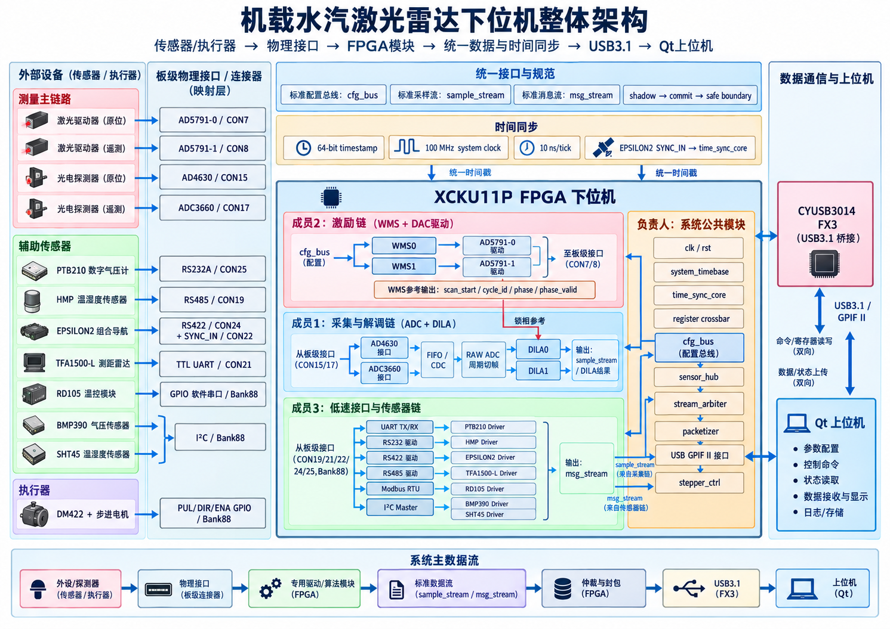

# 机载水汽激光雷达 FPGA 下位机项目启动会讲解稿

**版本：V1.2**  
**适用对象：项目负责人、3 名 FPGA 开发成员、1 名上位机对接人员**  
**建议会议时长：25–30 分钟**

---

## 0. 本次会议要解决什么

今天这次会不展开每个寄存器、状态机和时序细节，重点只把 6 件事说清楚：

1. **最终要做成什么系统；**
2. **整个下位机的数据和控制链路怎么走；**
3. **三位成员分别负责什么，边界在哪里；**
4. **大家必须统一遵守哪些接口和开发规范；**
5. **每个人最终要交什么，什么状态才算“完成”；**
6. **哪些问题可以自己解决，哪些问题必须及时同步。**

> 会议结束后的目标：所有成员可以直接按照各自任务书和仓库资料开始开发，不需要再重新讨论模块边界。

---

# 1. 项目最终目标

本项目最终要完成一套基于 **XCKU11P FPGA + FX3 + USB3.1 + Qt 上位机** 的机载水汽激光雷达下位机。

完整链路为：

**传感器 / 探测器 / 执行器 → 板级物理接口 → FPGA 驱动与算法模块 → 统一时间和统一数据流 → USB3.1 → Qt 上位机**

最终系统应具备以下能力：

- 两套 WMS 激励；
- 两路 DAC 输出激光调制波形；
- 两路 ADC 采集探测器信号；
- 双路 DILA 数字锁相与 1f / 2f 等谐波处理；
- 气压、温湿度、组合导航、测距、温控等辅助传感器采集；
- 步进电机控制；
- 全系统统一时间基准和时间戳；
- 统一寄存器配置、状态管理和数据格式；
- 通过 USB3.1 与上位机双向通信；
- 上位机能够完成参数配置、启动停止、状态读取、数据接收、显示与存储。

### 需要统一认识的一点

> 我们不是分别完成几个“能单独跑”的模块，而是共同完成一套**最终能够直接集成、统一配置、统一时间同步并通过 USB 与上位机通信的系统**。

因此，各模块的**接口一致性、时序边界和交付规范**与模块内部功能同样重要。

---

# 2. 整体系统架构

## 2.1 架构总图



### 建议现场按下面顺序讲这张图

从左向右讲：

1. **最左侧是所有外部设备**：两套光学测量链、辅助传感器和电机；
2. 外部设备先进入**板级物理接口和连接器**；
3. FPGA 内部再分成三条开发链：
   - 激励链：WMS + DAC；
   - 采集与解调链：ADC + DILA；
   - 辅助设备链：UART / RS232 / RS422 / RS485 / I²C + 传感器驱动；
4. 三条链最终都进入负责人负责的**公共系统层**；
5. 公共系统层统一完成：
   - 时间同步；
   - 寄存器访问；
   - 数据汇聚；
   - 仲裁；
   - 封包；
   - USB3.1 通信；
6. 最终通过 FX3 与 Qt 上位机通信。

---

## 2.2 外部设备、物理接口和 FPGA 功能映射

以下表格是本项目当前接口分工的基线。实际 RTL 开发时，以仓库中的详细架构文档、任务书、原理图和数据手册为准。

| 外部设备 | 板级接口/连接器 | FPGA 内部主要模块 | 最终数据/控制去向 | 负责人 |
|---|---|---|---|---|
| 原位激光驱动器 | AD5791-0 / CON7 | WMS0 → AD5791-0 Driver | 输出激光调制波形 | 成员2 |
| 遥测激光驱动器 | AD5791-1 / CON8 | WMS1 → AD5791-1 Driver | 输出激光调制波形 | 成员2 |
| 原位光电探测器 | AD4630 / CON15 | AD4630 PHY → FIFO/CDC → DILA0 | `sample_stream` / DILA结果 | 成员1 |
| 遥测光电探测器 | ADC3660 / CON17 | ADC3660 PHY → FIFO/CDC → DILA1 | `sample_stream` / DILA结果 | 成员1 |
| PTB210 数字气压计 | RS232A / CON25 | UART / RS232 → PTB210 Driver | `msg_stream` | 成员3 |
| HMP 温湿度传感器 | RS485 / CON19 | UART / RS485 / Modbus → HMP Driver | `msg_stream` | 成员3 |
| EPSILON2 组合导航 | RS422 / CON24 + SYNC_IN / CON22 | UART / RS422 → EPSILON2 Driver；SYNC_IN → time sync | `msg_stream` + 时间同步 | 成员3 + 负责人 |
| TFA1500-L 测距雷达 | TTL UART / CON21 | UART → TFA1500-L Driver | `msg_stream` | 成员3 |
| RD105 温控模块 | Bank88 GPIO 软件串口 | UART/协议驱动 → RD105 Driver | `msg_stream` / 控制 | 成员3 |
| BMP390 | I²C / Bank88 | I²C Master → BMP390 Driver | `msg_stream` | 成员3 |
| SHT45 | I²C / Bank88 | I²C Master → SHT45 Driver | `msg_stream` | 成员3 |
| DM422 + 步进电机 | PUL/DIR/ENA GPIO / Bank88 | `stepper_ctrl` | 电机动作控制 | 负责人 |
| Qt 上位机 | FX3 + USB3.1 / GPIF II | USB GPIF → packetizer / command / register | 双向命令、状态、数据 | 负责人 + 上位机对接人员 |

> **重要：** 具体 FPGA ball、IOSTANDARD、差分关系、方向以及 XDC 约束，不在会上逐项展开，成员开发时必须查各自任务书和硬件资料，不得凭经验猜测。

---

## 2.3 系统内部的四条核心逻辑链

### A. 激励链：WMS → DAC → 激光驱动器

```text
上位机配置
    ↓
cfg_bus
    ↓
WMS0 / WMS1
    ↓
锯齿 + 正弦合成
    ↓
DAC码字
    ↓
AD5791-0 / AD5791-1
    ↓
激光驱动器
```

这条链还必须向 DILA 提供统一的锁相参考：

```text
scan_start
cycle_id
phase
phase_valid
```

这些信号是**成员2与成员1之间唯一需要直接耦合的核心接口**。

---

### B. 采集与解调链：探测器 → ADC → DILA

```text
光电探测器
    ↓
AD4630 / ADC3660
    ↓
ADC PHY
    ↓
capture FIFO / CDC
    ├────────→ RAW ADC数据
    ↓
DILA
    ↓
1f / 2f / 2f/1f 等结果
```

关键要求：

- ADC 是**不可背压物理源**；
- ADC 前端不能因为后级 `ready=0` 而停采；
- 必须先进入 FIFO / 缓冲，再送后级；
- DILA 采样和 WMS 相位必须在时间上正确对应；
- ADC 样点先使用 `sample_stream`；DILA 的整周期两条谐波曲线进入 `bulk_stream`，按 fragment 输出；RAW ADC 周期数据也进入独立 bulk 通路。

---

### C. 辅助传感器链：原生协议 → 统一消息流

不同设备底层接口不同：

```text
RS232 / RS422 / RS485 / TTL UART / I²C / GPIO
                    ↓
            设备协议解析
                    ↓
              sensor driver
                    ↓
               msg_stream
```

系统上层**不关心** HMP 使用 Modbus、PTB 使用什么命令格式、SHT45 使用什么 I²C 时序。

所有设备差异都应封装在成员3负责的底层 driver 内。

---

### D. 系统公共链：统一配置、时间、汇聚和 USB

```text
上位机命令
    ↓
USB3.1 / FX3
    ↓
command / register access
    ↓
register crossbar
    ↓
cfg_bus
    ↓
各业务模块
```

数据反向汇聚：

```text
ADC sample_stream
   ├─→ DILA → fragmenter → DILA0/1 bulk FIFO ──────┐
   └─→ RAW cycle framer → RAW0/1 bulk FIFO ────────┤
传感器 → per-source msg FIFO → sensor_hub ─────────┤
系统 RESP / ERROR / STATUS FIFO ───────────────────┤
                                                    ↓
                                             stream_arbiter
                                      priority + RR + burst cap
                                                    ↓
                                                packetizer
                                                    ↓
                                              GPIF II / FX3
                                                    ↓
                                                  USB3.1
                                                    ↓
                                                 Qt上位机
```

---

# 3. 时间同步原则

整个系统采用统一时间基准，不允许各模块自行维护互不相关的时间计数器。

当前公共基线：

- `system clock`：100 MHz；
- 时间戳宽度：64 bit；
- 分辨率：10 ns/tick；
- EPSILON2 的 `SYNC_IN` 作为外部同步来源之一；
- 最终由统一 `time_sync_core` 管理系统时间。

需要带时间信息的数据至少包括：

- ADC/WMS 周期级数据；
- DILA 结果；
- 辅助传感器采样结果；
- 组合导航数据；
- 系统事件或异常状态。

### 时间同步的基本思想

> 设备可以有不同采样率，但进入系统数据层以后，必须能够通过统一时间戳判断“这条数据是什么时候产生的”。

---

# 4. 三位成员的任务分工

## 4.1 成员1：双 ADC + 双路 DILA

负责完整的**采集与解调链**：

- AD4630 接口；
- ADC3660 接口；
- ADC 数据捕获；
- FIFO / CDC；
- DILA0；
- DILA1；
- ADC → DILA 端到端仿真；
- 标准 `sample_stream` 和 DILA `bulk_stream` fragment 输出；
- DILA0/DILA1 各自独立 bulk FIFO，至少缓存 2 个最大 fragment；
- 每个 WMS 周期两条谐波曲线默认按 256 点/fragment 分片。

### 交付目标

负责人拿到成员1交付物后，应能够做到：

```text
实例化ADC/DILA模块
→ 接入物理ADC接口
→ 接入WMS锁相参考
→ 接cfg_bus
→ 接输出数据流
→ 直接进入系统集成
```

### 成员1不负责

- WMS 波形生成；
- DAC 驱动；
- USB；
- 系统 packetizer；
- 上位机协议。

---

## 4.2 成员2：双 WMS + 双 DAC

负责完整的**激励链**：

- WMS0；
- WMS1；
- AD5791-0 驱动；
- AD5791-1 驱动；
- WMS 参数更新；
- WMS → DAC 端到端仿真；
- 向 DILA 输出标准相位参考。

### 交付目标

负责人拿到成员2交付物后，应能够：

```text
接cfg_bus
→ 配置WMS参数
→ WMS生成波形
→ DAC输出
→ 同时得到scan_start/cycle_id/phase/phase_valid
```

### 成员2不负责

- ADC；
- DILA；
- 传感器协议；
- USB；
- 上位机。

---

## 4.3 成员3：公共 UART + 全部低速传感器

负责：

### 公共接口模块

- UART TX；
- UART RX；
- RS232；
- RS422；
- RS485；
- Modbus RTU；
- I²C Master；
- 需要的 GPIO/软件串口适配。

### 传感器 driver

- PTB210；
- HMP；
- EPSILON2；
- TFA1500-L；
- RD105；
- BMP390；
- SHT45。

### 统一输出

所有传感器最终统一输出标准：

```text
msg_stream
```

### 成员3不负责

- 系统 USB packetizer；
- 顶层 sensor_hub；
- 系统总 XDC；
- 系统时间核本身。

---

## 4.4 项目负责人负责的部分

负责人主要处理必须从系统全局角度完成的模块：

- 公共接口规范与寄存器空间；
- 时钟/复位框架；
- `system_timebase` / `time_sync_core`；
- RAW ADC 周期级组织；
- `register crossbar`；
- `sensor_hub`；
- `stream_arbiter`；
- `packetizer`；
- USB3.1 / FX3 / GPIF II；
- `stepper_ctrl`；
- 顶层模块；
- 总 XDC；
- 三名成员模块集成；
- 与上位机人员对接；
- 系统级联调和最终验收。

## 4.5 多传感器同时产生数据时如何避免冲突

多个传感器可能在同一时刻产生有效数据，因此不能把多个 driver 直接接到一条 `msg_stream` 上。正式结构为：

```text
PTB -> FIFO_PTB ----┐
HMP -> FIFO_HMP ----┤
EPS -> FIFO_EPS ----┤
BMP -> FIFO_BMP ----┤
SHT -> FIFO_SHT ----┤-> sensor_hub -> sensor msg_stream
TFA -> FIFO_TFA ----┤
RD  -> FIFO_RD -----┘
```

`sensor_hub` 按 **message-locked round-robin** 工作：一旦选中某个传感器，必须从该消息的 SOF 发送到 LAST 后才能换源。其他同时到达的数据先留在各自 FIFO 中，因此不会互相覆盖。

系统级 `stream_arbiter` 再在以下类别之间仲裁：

- P0：RESP / ERROR / critical EVENT；
- P1：时间同步、EPSILON2、关键状态；
- P2：普通低速传感器与状态；
- P3：DILA / RAW ADC bulk fragments。

同级 round-robin；高优先级连续服务默认最多 4 个 frame，若低优先级持续 pending，则必须让出一次服务机会，防止 starvation。

## 4.6 DILA 曲线不是“小消息”

DILA 每个 WMS 周期输出的是两条包含多个点的谐波曲线，而不是几个字节。正式默认数据格式为：

```text
H1[0], H2[0]
H1[1], H2[1]
...
H1[N-1], H2[N-1]
```

每点默认两个 `int32`，共 8 B。一个周期若点数较多，按照最多 256 点/fragment 拆分。每个 fragment 都携带：

- `cycle_id`；
- `timestamp`；
- `fragment_index / fragment_count`；
- `first_point_index / fragment_point_count`；
- `format / bytes_per_point`。

上位机按 `source_id + cycle_id + fragment_index` 重组完整曲线。这样既能完整传输 DILA 曲线，又不会让一个超长 DILA block 长时间独占总线。

---

# 5. 必须统一遵守的公共接口

所有成员必须直接使用仓库中冻结的公共定义，不允许自己再定义一套。

公共文件包括：

```text
project_defs.vh
stream_defs.vh
register_map.vh
error_codes.vh
```

## 5.1 四类标准接口

### `cfg_bus`

用于寄存器读写、参数配置、状态读取和 commit。

### `sample_stream`

只用于 ADC 样点级内部数据传输，例如 ADC capture FIFO → DILA / RAW framer。

### `msg_stream`

用于低速传感器、状态、事件和控制类短消息。每个独立 source 必须先进入自己的消息 FIFO。

### `bulk_stream`

用于 DILA 曲线和 RAW ADC 周期数据等大块数据。一个 SOF..LAST 代表一个可独立仲裁 fragment，正式最大 payload 8192 B。

---

## 5.2 `valid/ready` 统一规则

所有标准 stream 必须遵守：

```text
valid：发送端控制
ready：接收端控制
```

当：

```text
valid == 1 && ready == 1
```

表示当前拍完成一次数据传输。

如果：

```text
valid == 1 && ready == 0
```

发送端必须保持当前数据和相关 sideband 不变，直到握手成功。

> 不允许每个人自行设计不同的流控方法。

---

# 6. 参数更新与安全边界

对于 WMS、ADC、DILA 等实时模块，不能在一个工作周期中间直接修改关键参数。

统一采用：

```text
上位机写配置
    ↓
shadow register
    ↓
COMMIT
    ↓
safe boundary
    ↓
active register
```

例如：

- WMS 参数最好在新的扫描周期开始时生效；
- DILA 参数应在不会破坏当前处理窗口的位置生效；
- 不能出现一个周期前半段和后半段使用两套参数的情况。

---

# 7. 开发规范

## 7.1 统一环境

- FPGA：XCKU11P；
- 开发工具：Vivado；
- RTL 语言：Verilog；
- 所有正式代码必须可综合。

## 7.2 RTL 基本要求

- 一个模块承担清晰、单一的职责；
- 端口命名必须语义明确；
- 可配置常量优先使用 `parameter`；
- 避免 magic number；
- 时钟域必须明确；
- CDC 必须显式处理；
- 不允许组合逻辑直接跨时钟域；
- 不允许通过层次化路径访问其他模块内部寄存器；
- 模块接口不得依赖本地 testbench 的特殊行为。

## 7.3 硬件事实不得靠猜

以下内容必须查资料：

- FPGA ball / connector pin；
- IO 电平；
- ADC lane mapping；
- ADC/DAC 时序；
- 串口电气标准；
- 波特率；
- Modbus 参数；
- I²C 地址；
- 传感器寄存器和帧格式。

资料优先级：

```text
项目当前需求/冻结文档
    ↓
电路板原理图/引脚资料
    ↓
芯片datasheet
    ↓
设备用户手册
```

若资料之间冲突，**不要自行选择一个版本继续写**，应及时反馈。

---

# 8. Git 与协作规范

当前统一仓库：

```text
https://github.com/JiachengDong2026/Vapor_Radar_App_V2
```

默认以 `main` 中的最新冻结文档为项目基线。

建议开发分支：

```text
feature/adc-dila
feature/wms-dac
feature/sensors
```

### 禁止事项

成员不要自行修改：

- 公共 `project_defs.vh`；
- `stream_defs.vh`；
- `register_map.vh`；
- `error_codes.vh`；
- 总顶层；
- 总 XDC；
- USB 主协议。

如确实需要修改公共接口：

**先提出 → 负责人确认 → 统一修改 → 所有人同步。**

---

# 9. 每个人最终必须交什么

每个人最终交付的不是“能跑的一份代码”，而是**负责人能够直接合并的模块包**。

建议目录统一为：

```text
member_x/
├── rtl/
├── sim/
├── xdc/
├── docs/
└── reports/
```

## `rtl/`

- 正式 Verilog RTL；
- 仅保留最终有效源码；
- 模块名、端口和参数与任务书一致。

## `sim/`

- testbench；
- 激励文件；
- 仿真脚本；
- 自动结果检查；
- 必要时提供 golden model。

## `xdc/`

- 只提供本成员模块涉及的 XDC fragment；
- 不直接修改系统总 XDC。

## `docs/`

至少包含：

- README；
- 模块说明；
- 顶层接口说明；
- 时钟和复位说明；
- 寄存器说明；
- 使用方法；
- 已知限制。

## `reports/`

至少说明：

- 已完成内容；
- 未完成内容；
- 仿真结果；
- 综合结果；
- warning / limitation；
- 待确认问题；
- 当前是否达到 `READY_FOR_INTEGRATION`。

---

# 10. 测试与验收要求

每个成员至少完成三个层级。

## Level 1：单模块测试

例如：

- ADC PHY；
- WMS；
- DAC driver；
- DILA；
- UART；
- I²C；
- Modbus。

## Level 2：本成员完整功能链测试

### 成员1

```text
ADC → FIFO/CDC → DILA
```

### 成员2

```text
WMS → DAC formatter → AD5791
```

### 成员3

```text
物理接口协议 → sensor driver → msg_stream
```

## Level 3：边界与异常测试

至少覆盖：

- reset；
- backpressure；
- 连续数据；
- 最大/最小参数；
- 非法配置；
- timeout；
- CRC/帧错误（适用时）；
- 配置 commit；
- 长时间连续运行。

> “正常输入下跑通一次”不等于完成验收。

---

# 11. 上位机对接边界

上位机开发不属于本下位机团队内部模块开发范围，但必须完成接口对接。

下位机负责提供：

- USB 命令格式；
- 寄存器读写定义；
- 数据包格式；
- `source_id / msg_id`；
- 状态/错误码；
- 数据流和时间戳定义；
- 必要的测试数据。

上位机负责：

- USB 连接与收发；
- 配置界面；
- 命令下发；
- 状态显示；
- 数据解析；
- 数据显示与存储。

双方不应依赖对方内部实现，只以协议文档作为接口边界。

---

# 12. 遇到问题时怎么处理

## 先自行解决的局部问题

- 编译错误；
- 普通仿真失败；
- 状态机 bug；
- 位宽错误；
- 协议解析 bug；
- 局部 timing/CDC 问题。

这些问题优先自行定位、修改、重新验证。

## 必须及时同步的问题

- 原理图与数据手册冲突；
- 公共接口无法满足需求；
- 需要改变寄存器空间；
- 需要改变标准数据格式；
- 需要改变 WMS↔DILA 接口；
- 硬件接口不足；
- 会影响其他成员模块；
- 会改变系统总体架构。

一句话概括：

> **局部实现问题自行解决，系统性问题及时同步。**

---

# 13. 当前阶段的优先级

项目时间较紧，当前优先级按以下顺序执行：

```text
1. 功能正确
        ↓
2. 接口统一
        ↓
3. 仿真充分
        ↓
4. 可综合
        ↓
5. 可直接集成
        ↓
6. 再做资源/性能优化
```

不要在系统尚未闭环时过早追求极致 LUT、极端流水线或不必要的复杂抽象。

---

# 14. 会议结束前必须确认的 7 件事

逐项确认：

- [ ] 每个人是否清楚自己的模块范围；
- [ ] 是否清楚哪些内容明确“不属于自己”；
- [ ] 是否清楚自己模块的输入、输出和时钟域；
- [ ] 是否清楚与其他成员之间的唯一接口；
- [ ] 是否清楚公共文件不能私自修改；
- [ ] 是否清楚最终交付目录和验收标准；
- [ ] 是否还有阻止现在开工的硬件资料或需求缺失。

如果全部确认，则会后直接进入开发。

---

# 15. 会后立即执行的动作

### 全体成员

1. 拉取/同步当前 `main`；
2. 阅读：
   - 自己的 V1.2 任务书；
   - 公共接口规范；
   - 寄存器冻结表；
   - 对应硬件 datasheet / 原理图；
3. 建立个人开发分支；
4. 先完成接口 skeleton 和单模块 testbench；
5. 再逐步填充功能实现。

### 负责人

- 完成公共前置 RTL 基础设施；
- 维护公共接口定义；
- 推进公共系统模块；
- 处理中途出现的架构级问题；
- 准备后续三路模块集成和 USB 联调。

### 上位机对接人员

- 获取协议和数据格式；
- 提前搭建 USB transport / parser 框架；
- 与下位机负责人保持协议级对接。

---

# 16. 建议会议时间分配

| 内容 | 建议时间 |
|---|---:|
| 项目最终目标 | 2 min |
| 整体架构和数据流 | 5 min |
| 三人任务分工 | 7 min |
| 公共接口和开发规范 | 5 min |
| 交付与测试要求 | 4 min |
| 问题确认和会后动作 | 2–4 min |

总时长建议控制在 **25–30 分钟**。

---

# 17. 最后一句话

这次项目的核心不是“每个人把自己的代码写完”，而是：

> **所有模块按照同一套接口、同一套时间和数据规范开发，最后能够快速、低风险地合并成一套真正可运行的下位机。**

会后所有开发工作统一以仓库最新冻结文档和各自任务书为准。
